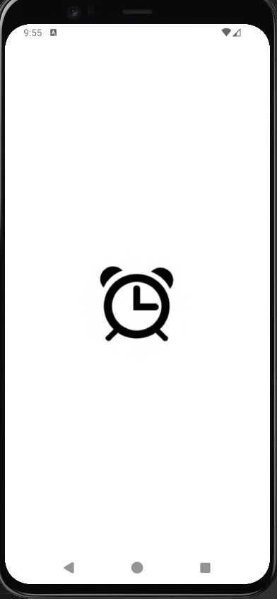
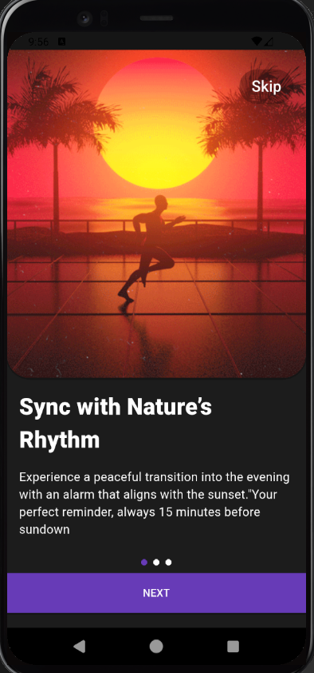
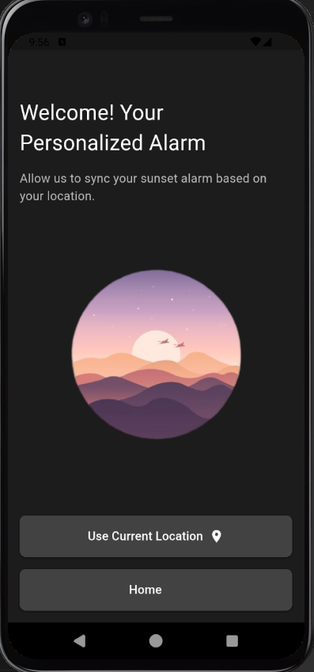
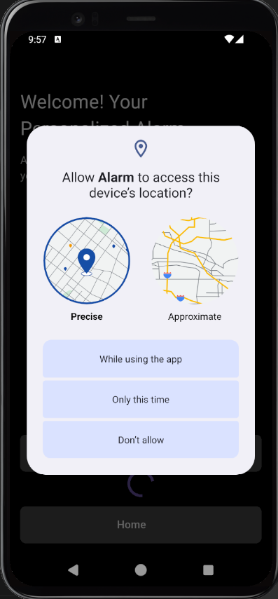
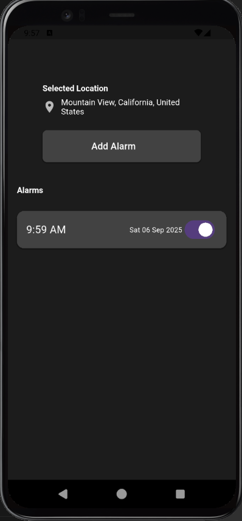
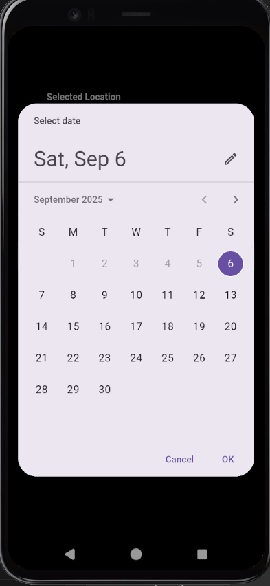
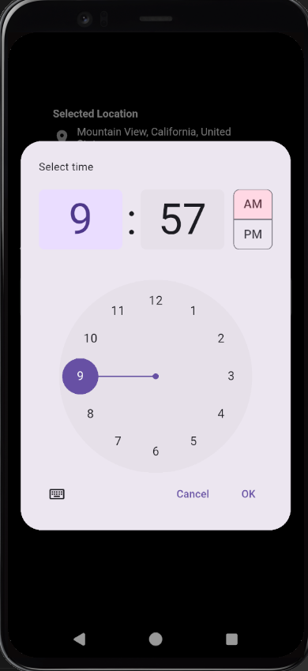
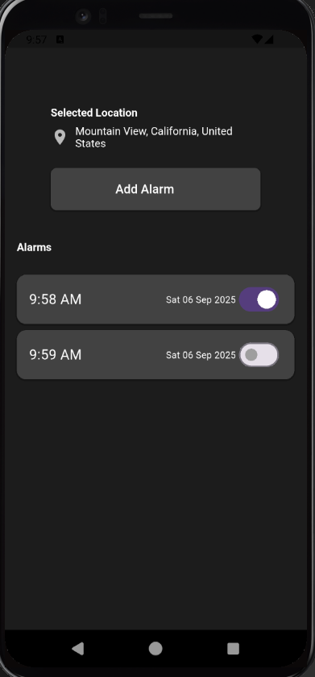

# My App

A Flutter alarm app with location-based notifications, customizable alarms, and a sleek, interactive UI.

---
## Features

- Set alarms with local notifications.  
- Location-based features using GPS.  
- Persistent storage using Hive database.  
- Time zone support for alarms across regions.   

---

## Project Setup

### Prerequisites

- [Flutter SDK](https://docs.flutter.dev/get-started/install) >= 3.9.0  
- Android Studio or Xcode (for iOS development)  
- Dart >= 3.9.0  
- Device or emulator for testing  

### Clone Repository

```bash
git clone https://github.com/farhad-fbm/alarm_app_flutter.git
cd alarm_app_flutter


## Install Dependencies
flutter pub get
```

  
### Screenshots
**Splash Screen**  **Onboard Screen**  

<p float="left">
  
  
  
</p>


**Location Setup Screen**  
<p float="left">
  
  
</p>


**Alarm Setup Screen**  
<p float="left">
  
  
  
  
</p>

